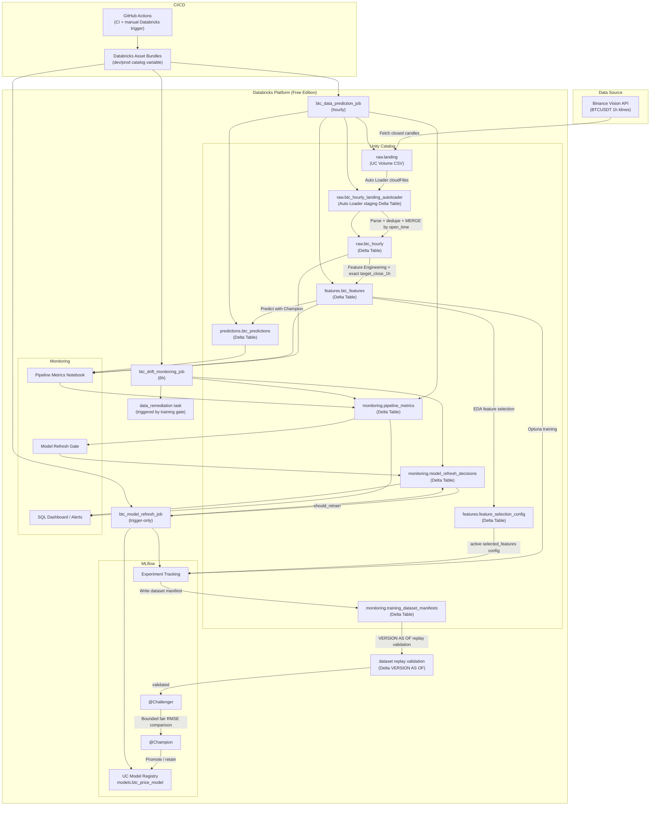
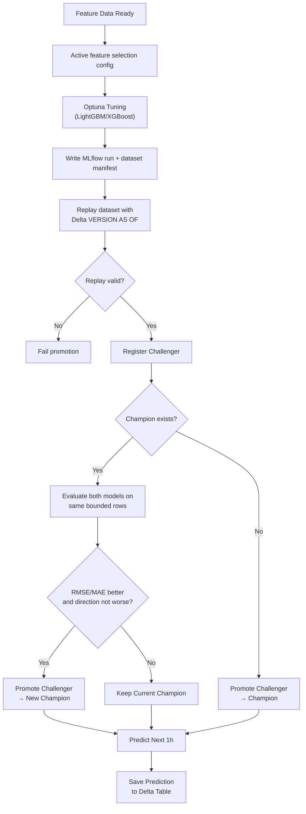

# Kế hoạch triển khai: BTC Databricks MLOps Project

Dự án xây dựng hệ thống MLOps end-to-end trên Databricks cho bài toán dự đoán giá Bitcoin (hourly time series), bao gồm: data pipeline, model training với cơ chế Champion vs Challenger, CI/CD tự động, và monitoring toàn diện.

---

## Tổng quan kiến trúc



Ghi chú kiến trúc hiện tại:
- Job hourly chính do Databricks quản lý: `btc_data_prediction_job` chạy fetch -> Auto Loader ingestion -> feature engineering -> prediction -> monitoring -> job quality monitoring.
- Job drift riêng: `btc_drift_monitoring_job` chạy drift metrics -> training gate -> conditional model refresh trigger / data remediation mỗi 6 giờ.
- Task remediation trong `btc_drift_monitoring_job` xử lý các lỗi data an toàn như raw stale, feature mismatch, prediction stale; lỗi nguy hiểm vẫn yêu cầu manual review.
- Job refresh model: `btc_model_refresh_job` là trigger-only, chạy EDA feature selection -> regression-only Optuna training -> dataset replay validation -> Champion/Challenger; training notebook yêu cầu latest training-gate decision còn fresh và `should_retrain=true`.
- GitHub Actions không còn là hourly scheduler chính; workflow hourly chỉ còn manual trigger nếu cần.
- Tất cả notebooks nhận `catalog` từ Databricks widget do DAB truyền vào: `btc_dev` cho dev, `btc_prod` cho prod.
- `target_close_1h` là exact next-hour close bằng self-join theo `open_time + 1 hour`, không dùng next-row `lead`.
- Feature selection dùng append-only `features.feature_selection_config`, chỉ một config `is_active=true`; config ghi source feature table version, target, candidates, dropped features và selection metrics.
- Training ghi raw/features/config Delta versions vào MLflow và `monitoring.training_dataset_manifests`; `12_training_dataset_replay.py` xác thực lại dataset bằng Delta `VERSION AS OF` trước khi cho phép promote model.
- Prediction ghi model version/run ID, prediction-input raw/features versions, và Champion training data/config versions vào `predictions.btc_predictions` để trace từng prediction.

---

## Kế hoạch theo tuần

---

### Tuần 1: Setup, Thiết kế & Ingestion

> [!IMPORTANT]
> Tuần này tập trung vào thiết kế kiến trúc, setup môi trường và dựng pipeline nạp dữ liệu thô (Ingestion).

#### Mục tiêu
- Nghiên cứu & quyết định kiến trúc Delta Lake, Unity Catalog, MLflow.
- Setup Git, SP OIDC, và catalog schema (`btc_dev`/`btc_stg`/`btc_prod`).
- Xây dựng ingestion tải dữ liệu từ Binance API vào UC Volume, dùng Auto Loader nạp incremental vào Delta.

#### Tasks

| # | Task | Chi tiết | Databricks Feature / Tool |
|---|------|----------|-------------------|
| 1.1 | Nghiên cứu Unity Catalog vs DBFS | - Catalog: quản lý metadata tập trung, governance, lineage<br/>- DBFS: file system đơn giản, không có governance<br/>- **Quyết định**: Dùng Unity Catalog cho production | Unity Catalog |
| 1.2 | Nghiên cứu Delta vs Parquet | - Delta: ACID transactions, time travel, schema evolution, merge/upsert<br/>- Parquet: chỉ là format lưu trữ, không có transaction<br/>- **Quyết định**: Dùng Delta cho cả raw và features layer | Delta Lake |
| 1.3 | Thiết kế Catalog schema (multi-env) | - Catalog theo environment: `btc_dev`, `btc_stg`, `btc_prod`<br/>- Schema trong mỗi catalog: `raw`, `features`, `predictions`<br/>- VD: `btc_dev.raw.btc_hourly`<br/>- Tách biệt hoàn toàn giữa các môi trường (cùng 1 workspace, khác catalog) | Unity Catalog |
| 1.4 | Nghiên cứu MLflow trên Databricks | - Experiment tracking, model registry<br/>- Champion/Challenger workflow<br/>- Model versioning & aliases | MLflow |
| 1.5 | Nghiên cứu Databricks CLI | - Setup databricks-cli ở local<br/>- Tạo/quản lý resources bằng terminal<br/>- Databricks Asset Bundles (DABs) | Databricks CLI |
| 1.6 | Setup GitHub repo & branching strategy | - Branch: `main`, `dev`, `feature/*`<br/>- Cấu trúc thư mục project | GitHub |
| 1.7 | Xây dựng Data Ingestion notebook/script | - Kéo dữ liệu BTC hourly từ **Binance API** vào UC Volume landing<br/>- Dùng Auto Loader đọc incremental vào `btc_dev.raw.btc_hourly_landing_autoloader`<br/>- Parse/dedupe và MERGE vào `btc_dev.raw.btc_hourly` | Notebooks, Auto Loader, Delta Lake |
| 1.8 | Backfill dữ liệu lịch sử | - Kéo dữ liệu từ 2025-01-01 → nay (~12,000+ rows)<br/>- Kiểm tra data quality sau backfill | Delta Lake, SQL |

#### Deliverables
- [x] Tài liệu so sánh Catalog vs DBFS, Delta vs Parquet
- [x] Sơ đồ kiến trúc chi tiết
- [x] Catalog schema design document (multi-env: btc_dev/stg/prd)
- [x] GitHub repo với cấu trúc thư mục chuẩn
- [ ] Ingestion notebook/script hoạt động và backfill thành công

---

### Tuần 2: Feature Engineering & Model Training (Optuna)

#### Mục tiêu
- Xây dựng feature engineering pipeline và quản lý feature selection bằng Delta metadata config.
- Xây dựng model training pipeline regression-only với Optuna hyperparameter tuning (single-node).

#### Tasks

| # | Task | Chi tiết | Databricks Feature |
|---|------|----------|-------------------|
| 2.1 | Feature Engineering pipeline | - Tạo features từ raw data:<br/>  • Moving averages (MA7, MA24, MA168)<br/>  • RSI, MACD, Bollinger Bands<br/>  • Lag features (1h, 2h, 4h, 12h, 24h)<br/>  • Volume features<br/>  • Time-based features (hour, day_of_week)<br/>- Lưu vào `btc_dev.features.btc_features` | Feature Engineering |
| 2.2 | Quản lý Feature Delta Table | - Lưu features vào Delta table<br/>- Tạo feature selection config append-only<br/>- Chỉ một config active tại một thời điểm<br/>- Lưu source table version, candidates, dropped features, selection metrics | Feature Delta table / metadata config |
| 2.3 | Data validation | - Kiểm tra null, duplicate, outlier<br/>- Đảm bảo tính liên tục của time series | Data Quality |
| 2.4 | Time Series Data Split | - Temporal split: 80% train, 10% validation, 10% test<br/>- Không random shuffle<br/>- Đảm bảo không data leakage | Python/Spark |
| 2.5 | Training pipeline regression với Optuna Tuning | - Target: `target_close_1h` regression<br/>- Thuật toán candidates trong job refresh hiện tại: LightGBM và XGBoost<br/>- Dùng **Optuna** với TPE Bayesian optimization<br/>- Chạy single-node (phù hợp Free Edition serverless)<br/>- `MedianPruner` early stopping cho trials không triển vọng<br/>- Log tất cả trials vào MLflow (child runs) | MLflow + Optuna |

> [!NOTE]
> **Optuna trên Free Edition**: Free Edition dùng serverless compute, không có PySpark executors thật sự để chạy parallel trials. Dùng `optuna.create_study()` thông thường (single-node) kết hợp MLflow logging thủ công là đủ để demo và hoạt động ổn định.
>
> ```python
> import optuna
> import mlflow
>
> def objective(trial):
>     params = {
>         "n_estimators": trial.suggest_int("n_estimators", 100, 500),
>         "max_depth": trial.suggest_int("max_depth", 3, 10),
>         "learning_rate": trial.suggest_float("learning_rate", 1e-3, 0.3, log=True),
>     }
>     with mlflow.start_run(nested=True):
>         mlflow.log_params(params)
>         # train & evaluate
>         mlflow.log_metric("rmse", rmse)
>     return rmse
>
> study = optuna.create_study(direction="minimize",
>                             pruner=optuna.pruners.MedianPruner())
> study.optimize(objective, n_trials=50)
> ```

#### Deliverables
- [ ] Feature engineering pipeline & active feature selection config
- [ ] Regression training pipeline notebook với Optuna tuning hoạt động ổn định

---

### Tuần 3: Model Registry & CI/CD (GitHub Actions + DABs)

> [!IMPORTANT]
> Dữ liệu là time series → **KHÔNG được random split**. Phải dùng temporal split (train trên quá khứ, test trên tương lai).

#### Mục tiêu
- Xây dựng so sánh Champion vs Challenger sử dụng Model Aliases.
- Thiết lập CI/CD pipeline với GitHub Actions và Databricks Asset Bundles (DABs).

#### Tasks

| # | Task | Chi tiết | Databricks Feature / Tool |
|---|------|----------|-------------------|
| 3.1 | Auto-select Best Model (Challenger) | - So sánh metrics (RMSE, MAE, MAPE) trên validation set<br/>- Tự động chọn model tốt nhất → **Challenger**<br/>- Register Challenger vào Model Registry | MLflow Model Registry |
| 3.2 | Champion vs Challenger Comparison | - Load Champion hiện tại từ Model Registry (production alias `@Champion`)<br/>- Bắt buộc dataset replay validation pass trước promotion<br/>- So sánh Challenger vs Champion trên cùng bounded common holdout rows<br/>- Promote khi Challenger cải thiện RMSE và MAE, đồng thời directional accuracy không giảm<br/>- Nếu không đạt multi-metric gate → giữ nguyên Champion | MLflow Model Registry + Delta Time Travel |
| 3.3 | Prediction pipeline | - Model thắng cuộc predict giá BTC cho next 1 hour<br/>- Lưu prediction vào `btc_dev.predictions.btc_predictions` | MLflow, Delta Lake |
| 3.4 | Setup Databricks Asset Bundles (DABs) | - Định nghĩa jobs, notebooks trong `databricks.yml`<br/>- Tách config cho dev/prod bằng DABs `targets` (cùng workspace, khác catalog) | Databricks CLI, DABs |
| 3.5 | GitHub Actions CI/CD Pipeline | - **CI (on PR/Push)**: Lint, unit test, validate bundle<br/>- **CD (on Merge)**: Deploy bundle lên Databricks và cập nhật Jobs | GitHub Actions |
| 3.6 | Environment management | - Secrets: API keys, Databricks tokens<br/>- GitHub Secrets → Databricks Secrets | GitHub Secrets, Databricks Secrets |

> [!NOTE]
> **DABs trên Free Edition**: Free Edition chỉ có 1 workspace. Multi-environment được implement bằng cách dùng DABs `targets` với catalog name khác nhau — không cần nhiều workspace.
>
> ```yaml
> # databricks.yml
> targets:
>   dev:
>     workspace:
>       host: ${DATABRICKS_HOST}
>     variables:
>       catalog: btc_dev
>   prod:
>     workspace:
>       host: ${DATABRICKS_HOST}
>     variables:
>       catalog: btc_prod
> ```
> Deploy dev: `databricks bundle deploy --target dev`
> Deploy prod: `databricks bundle deploy --target prod`

#### Workflow Champion vs Challenger



#### Metrics đánh giá

| Metric | Mô tả | Mục đích |
|--------|--------|----------|
| RMSE | Root Mean Squared Error | Đánh giá tổng thể |
| MAE | Mean Absolute Error | Dễ diễn giải |
| MAPE | Mean Absolute Percentage Error | So sánh tương đối |
| R² | Coefficient of Determination | Giải thích variance |
| Time to tune | Training time for all trials | Đánh giá hiệu quả tuning |
| n_trials / early_stopped | Số trials chạy / bị dừng sớm | Đo mức độ hội tụ của Optuna |

#### Deliverables
- [ ] Replay-gated Champion vs Challenger comparison logic & prediction pipeline
- [ ] Databricks Asset Bundle config & GitHub Actions CI/CD workflows hoạt động

---

### Tuần 4: Deploy & Monitoring

#### Mục tiêu
- Thiết lập Databricks Workflows chạy định kỳ.
- Xây dựng AI/BI Dashboard và hệ thống cảnh báo tự động.

#### Tasks

| # | Task | Chi tiết | Databricks Feature |
|---|------|----------|-------------------|
| 4.1 | Databricks Jobs (Schedule) | - **Data Prediction Job** (chạy 1h/lần): Fetch Binance -> Auto Loader Ingestion -> Feature Engineering -> Prediction -> Monitoring -> Job Quality Monitoring<br/>- **Drift Monitoring Job** (chạy 6h/lần): Drift Monitoring -> Training Gate -> Conditional Model Refresh Trigger + Data Remediation<br/>- **Model Refresh Job** (trigger-only): EDA Feature Selection -> Regression Optuna Training -> Dataset Replay Validation -> Champion/Challenger, guarded by latest training-gate decision<br/>- Cấu hình retry, timeout, alerts | Databricks Jobs/Workflows |
| 4.2 | Data Quality + Data Drift Monitoring | - Fallback metrics: row count, duplicate `open_time`, null `open_time`, freshness, target null count<br/>- Drift metrics: PSI/KS cho selected features, label drift cho `target_close_1h`, prediction drift cho `predicted_close`<br/>- Alert khi data bất thường hoặc drift vượt threshold | Delta metrics tables, Databricks SQL Alerts |
| 4.3 | Model Performance / Concept Drift Monitoring | - Theo dõi prediction accuracy theo thời gian<br/>- So sánh actual vs predicted bằng join `predictions.feature_open_time + 1 hour = raw.open_time`<br/>- Metrics: rolling RMSE/MAE/MAPE, direction accuracy, p95 error, signed error bias proxy cho concept drift<br/>- Alert khi performance giảm hoặc drift vượt threshold | MLflow, Delta metrics tables |
| 4.3b | Data Version Control production-like | - Log `raw_table_version`, `features_table_version`, `feature_config_version`, `feature_config_id` vào MLflow<br/>- Ghi `training_dataset_manifests` cho mỗi training run<br/>- Replay manifest bằng Delta `VERSION AS OF` trước promotion<br/>- Ghi prediction-input và Champion-training lineage vào `btc_predictions` | Delta Lake Time Travel, MLflow |

Drift-triggered retraining rule:

```text
Data drift / prediction drift / feature drift alert
        ↓
Validate data quality + schema quality + feature quality
        ↓
Retrain only if validation passes
```

Implementation detail:
- `btc_data_prediction_job` không chạy drift/training để giữ hourly serving path ngắn và ổn định.
- `btc_drift_monitoring_job` ghi drift metrics, training gate decisions, trigger model refresh khi `should_retrain=true`, và chạy data remediation khi có lỗi data an toàn.
- `btc_model_refresh_job` là nơi duy nhất chạy regression retraining, dataset replay validation và Champion/Challenger promotion, nhưng không có schedule riêng. Promotion được serialize để tránh race khi LightGBM/XGBoost cùng cập nhật alias `@Champion`.

| 4.4 | Job Quality Monitoring | - Theo dõi: job success/failure rate, failed runs, failed tasks, latest run duration<br/>- Ghi metrics vào `monitoring.pipeline_metrics` qua `notebooks/09_job_quality_monitoring.py`<br/>- Alert khi job fail hoặc chạy quá lâu | Databricks Jobs API, Delta metrics tables, Alerts |
| 4.5 | Tạo Dashboard | - Tổng hợp tất cả metrics monitoring<br/>- Hiển thị: data freshness, model accuracy trend, job status, biểu đồ actual vs predicted price | Databricks Dashboard (Lakeview) |
| 4.6 | Thiết lập Alerts | - SQL alerts được quản lý bằng DAB trong `databricks/resources/alerts.yml`<br/>- Cần truyền `sql_warehouse_id` khi deploy<br/>- Email/Slack notification khi job fail, data quality issue hoặc model performance drop | Databricks Alerts |

#### Dashboard mockup

```
┌─────────────────────────────────────────────────────────┐
│                 BTC MLOps Dashboard                     │
├───────────────┬───────────────┬─────────────────────────┤
│ Data Quality  │ Model Perf    │ Job Status              │
│ ✅ Fresh      │ RMSE: 125.3   │ ✅ Last run: 14:00 OK   │
│ ✅ Complete   │ MAE: 89.2     │ Success rate: 99.2%     │
│ ✅ No drift   │ MAPE: 0.12%   │ Avg duration: 3m 42s    │
├───────────────┴───────────────┴─────────────────────────┤
│          Actual vs Predicted Price (Last 7 days)        │
│  📈 [Chart]                                             │
├─────────────────────────────────────────────────────────┤
│          Model Performance Trend (Last 30 days)         │
│  📊 [Chart]                                             │
└─────────────────────────────────────────────────────────┘
```

#### Deliverables
- [ ] `btc_data_prediction_job`, `btc_drift_monitoring_job`, và `btc_model_refresh_job` hoạt động ổn định trên Databricks
- [ ] Data remediation audit table và trigger model refresh hoạt động đúng theo training gate decision
- [ ] Data, Model & Job Quality monitoring setup
- [ ] Dashboard hoàn chỉnh & Alert configuration

---

## Cấu trúc thư mục dự án

```
BTC/
├── .github/
│   └── workflows/
│       ├── cicd.yml
│       └── hourly-trigger.yml
├── databricks.yml              # Root DAB config: bundle, variables, dev/prod targets
├── databricks/
│   ├── resources/
│   │   └── jobs.yml            # Databricks Jobs definitions
│   └── sql/
│       ├── dashboard_queries.sql
│       └── alert_queries.sql
├── notebooks/
│   ├── 00_fetch_binance_to_volume.py # Fetch Binance Vision API -> UC Volume
│   ├── 01_data_ingestion.py          # Auto Loader landing CSV -> staging Delta -> raw Delta MERGE
│   ├── 02_feature_engineering.py     # Features + exact target_close_1h
│   ├── 02b_eda_feature_selection.py  # Active feature selection config governance
│   ├── 03_model_training.py          # Legacy baseline notebook, not model refresh path
│   ├── 03_optuna_training.py         # Regression Optuna LightGBM/XGBoost training
│   ├── 04_champion_challenger.py     # Replay-gated fair Champion/Challenger promotion
│   ├── 05_prediction.py              # Predict next 1h with @Champion
│   ├── 06_monitoring.py              # Pipeline metrics writer
│   ├── 07_training_gate.py           # Training/retraining gate decisions
│   ├── 10_data_remediation.py        # Safe data remediation actions
│   ├── 11_trigger_model_refresh.py   # Conditional model refresh trigger
│   └── 12_training_dataset_replay.py # Delta VERSION AS OF dataset replay validation
├── src/
│   ├── data/
│   │   ├── binance_landing.py
│   │   ├── ingestion.py
│   │   └── features.py
│   ├── models/
│   │   ├── training.py
│   │   └── evaluation.py
│   ├── monitoring/
│   │   ├── data_quality.py
│   │   └── model_performance.py
│   └── utils/
│       ├── config.py
│       └── logger.py
├── scripts/
│   └── fetch_binance_to_volume.py
├── tests/
│   ├── test_binance_landing.py
│   ├── test_ingestion.py
│   ├── test_features.py
│   └── test_training.py
├── docs/
│   ├── index.md
│   ├── btc-databricks-mlops-project.md
│   ├── architecture.md
│   ├── catalog-schema.md
│   └── monitoring-dashboard.md
├── _bmad-output/
│   ├── planning-artifacts/
│   └── implementation-artifacts/
├── pytest.ini
└── requirements.txt
```

> [!NOTE]
> `databricks.yml` nằm ở root repo và là nguồn duy nhất cho DAB `bundle`, `variables`, `targets`. File `databricks/resources/jobs.yml` chỉ chứa `resources.jobs` để tránh conflict cấu hình.

> [!NOTE]
> Các notebook trong Databricks Job dùng Git source path không có `.py`, ví dụ `notebooks/01_data_ingestion`, dù file trong repo là `notebooks/01_data_ingestion.py`.

---

## Databricks Features Mapping

| Nhiệm vụ | Databricks Feature | Ghi chú |
|-----------|-------------------|---------|
| Lưu trữ dữ liệu | **Unity Catalog** + **Delta Lake** | Vẫn dùng được trên Free edition |
| Feature Engineering | **Feature Delta table / metadata config** | Quản lý features tập trung |
| Train model | **MLflow Experiments** | Auto-log params, metrics, artifacts |
| Model Registry | **MLflow Model Registry** | Champion/Challenger với aliases |
| Hyperparameter Tuning | **Optuna** + **MLflow** | TPE Bayesian optimization, single-node, early stopping |
| Chạy job | **Databricks Jobs/Workflows** | Data Prediction (1h) + Drift Monitoring (6h, triggers remediation/refresh) + Model Refresh (trigger-only) |
| CI/CD | **Databricks Asset Bundles (DABs)** | IaC cho Databricks resources, multi-env qua targets |
| Data Quality | **Delta metrics tables** | Fallback monitoring qua `monitoring.pipeline_metrics`; data drift PSI/KS là bước mở rộng tiếp theo |
| Model Monitoring | **Delta metrics tables** + **MLflow** | Actual vs predicted, refresh decisions, model registry aliases; rolling performance drift là bước mở rộng tiếp theo |
| Dashboard | **Lakeview Dashboard** | SQL-based dashboards |
| Alerts | **Databricks Alerts** | Email/Slack notifications |
| CLI management | **Databricks CLI** | Tạo/quản lý resources từ local |

---

## Tất cả quyết định đã được thống nhất ✅

> [!NOTE]
> ✅ **Data Source API**: Binance Vision API
> ✅ **Databricks Workspace**: Free edition
> ✅ **Databricks tier**: Free edition (vẫn dùng Unity Catalog)
> ✅ **DBR version**: 17.3 LTS ML (LTS mới nhất, supported đến 10/2028)
> ✅ **Target variable**: `target_close_1h` exact next-hour close (regression)
> ✅ **Retraining**: Model Refresh Job trigger-only, gated by training gate decisions
> ✅ **Alert channels**: Email + Slack
> ✅ **Optuna**: single-node (phù hợp Free Edition serverless, không dùng MlflowSparkStudy)
> ✅ **Multi-env**: DABs targets với catalog name khác nhau (btc_dev / btc_prod) trong cùng 1 workspace

> [!NOTE]
> ℹ️ **Compute**: Free Edition dùng serverless compute, không có cluster cost. Databricks tự quản lý, chỉ cần theo dõi daily quota.

---

## Verification Plan

### Automated Tests
- Unit tests cho data ingestion, feature engineering, model training
- Integration test: chạy full pipeline trên sample data
- Validate Delta Table schema sau mỗi bước

### Manual Verification
- Kiểm tra dữ liệu trên Databricks UI (Catalog Explorer)
- Review MLflow experiments & model registry
- Kiểm tra Dashboard hiển thị đúng metrics
- Chạy thử `btc_data_prediction_job` hourly path, `btc_drift_monitoring_job` drift/remediation/trigger path, và `btc_model_refresh_job` refresh path
- Kiểm tra actual vs predicted bằng join prediction với raw candle kế tiếp
