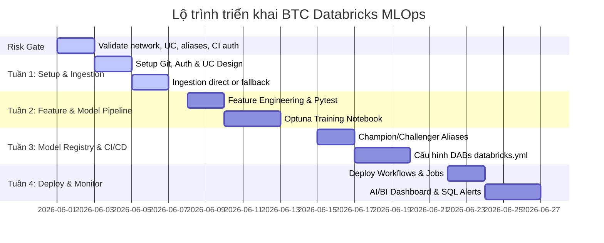

# Báo cáo Nghiên cứu Kỹ thuật: Đánh giá Kế hoạch Triển khai BTC Databricks MLOps

Báo cáo này đánh giá tính khả thi của kế hoạch triển khai hệ thống MLOps dự báo giá BTC theo giờ trên **Databricks Free Edition**, tập trung vào các rủi ro kỹ thuật có thể làm chặn triển khai: network egress, quota compute, Model Registry trên Unity Catalog, CI/CD authentication, scheduling và monitoring.

> [!IMPORTANT]
> Một số kết luận trong bản kế hoạch cần được xác minh trực tiếp trên workspace Free Edition đang dùng. Các mục có nhãn **Cần xác minh** không nên được xem là quyết định cuối cùng cho đến khi có kết quả test hoặc dẫn chứng chính thức.

---

## 1. Phát hiện Kỹ thuật Cốt lõi & Khuyến nghị

### 1.1. Giới hạn mạng (Outbound Block)
* **Rủi ro:** Nếu Serverless Compute trong Databricks Free Edition không cho phép outbound internet hoặc chặn endpoint Binance, ingestion notebook/job sẽ không thể gọi trực tiếp Binance API.
* **Trạng thái:** **Cần xác minh** bằng notebook/job thực tế trong workspace Free Edition.
* **Khuyến nghị chính:** Trước khi build pipeline ingestion, chạy spike tối thiểu gọi Binance `/api/v3/klines` từ Databricks notebook và ghi lại lỗi/success.
* **Fallback:** Nếu outbound bị chặn, dùng runner trung gian độc lập như GitHub Actions Runner hoặc AWS Lambda free tier để tải dữ liệu Binance, đóng gói CSV/Parquet, rồi upload vào Unity Catalog Volume bằng Databricks CLI hoặc REST API.

### 1.2. Giới hạn tài nguyên (Compute Quotas)
* **Rủi ro:** Optuna 50 trials với nhiều thuật toán candidate có thể vượt quota hoặc làm job retrain không ổn định trên Free Edition.
* **Khuyến nghị:** Đặt default `n_trials=15`, `max_trials=20`, dùng `MedianPruner`, cấu hình timeout theo job và log số trial bị prune vào MLflow.
* **Điều chỉnh lịch retrain:** Bắt đầu với retrain **12h/lần** trong giai đoạn đầu. Chỉ giảm xuống 6h hoặc 3h sau khi đo được duration, quota consumption và độ ổn định job.
* **Fallback:** Nếu quota vẫn thiếu, tách training thủ công/on-demand khỏi prediction hourly; ingestion và prediction vẫn chạy định kỳ, retrain chạy ít hơn.

### 1.3. Quản lý mô hình (Model Registry)
* **Rủi ro:** Stage-based Model Registry (`Staging`/`Production`) không còn là hướng triển khai phù hợp cho Unity Catalog.
* **Khuyến nghị:** Dùng **Model Aliases** như `@Champion` và `@Challenger` với registered model dạng `catalog.schema.model_name`.
* **Cách thao tác:** Promotion/demotion nên thực hiện bằng MLflow Python API hoặc REST API. SQL chủ yếu dùng cho quản trị Unity Catalog như `GRANT`, ownership và schema/table governance.
* **Đường dẫn load model:** `models:/<catalog>.<schema>.<model_name>@Champion`.

### 1.4. Xác thực CI/CD bảo mật
* **Rủi ro:** Dùng Personal Access Token (PAT) dài hạn trong GitHub Secrets dễ tạo rủi ro lộ lọt và khó kiểm soát vòng đời.
* **Khuyến nghị chính:** Ưu tiên Workload Identity Federation/OIDC giữa GitHub Actions và Databricks Service Principal nếu Free Edition/workspace hiện tại hỗ trợ đầy đủ.
* **Trạng thái:** **Cần xác minh** quyền tạo Service Principal, federation policy và quyền deploy bundle trong workspace Free Edition.
* **Fallback:** Nếu OIDC không khả dụng, dùng PAT có thời hạn ngắn, scope tối thiểu, lưu trong GitHub Environments, bật required reviewers cho deploy prod và đặt lịch rotation.

### 1.5. Monitoring & Alerting
* **Rủi ro:** Lakehouse Monitoring, Databricks SQL Alerts, Slack/email notifications hoặc AI/BI Dashboard có thể có giới hạn theo edition/workspace.
* **Khuyến nghị:** Thiết kế monitoring theo 2 tầng: tầng managed feature nếu khả dụng, và tầng fallback bằng Delta monitoring tables + SQL dashboard thủ công.
* **Fallback tối thiểu:** Ghi `job_run_metrics`, `data_quality_metrics`, `prediction_metrics` vào Delta tables; dashboard đọc trực tiếp các bảng này; alert ban đầu dựa vào Databricks Job notifications hoặc GitHub Actions failure notification.

---

## 2. Bảng so sánh Registry: Stage-based vs Alias-based

| Tiêu chí | Stage-based (Cũ) | Alias-based (Hiện tại - Unity Catalog) |
|---|---|---|
| **Cơ chế** | Chuyển Stage cứng (`Staging`, `Production`) | Sử dụng các thẻ tên động (Aliases như `@Champion`, `@Challenger`) |
| **Bảo mật** | Phân quyền mức Workspace rộng | Phân quyền 3 cấp bằng SQL GRANT trong Unity Catalog |
| **Đường dẫn** | `models:/<model_name>/production` | `models:/<catalog>.<schema>.<model_name>@Champion` |
| **Khuyến nghị** | Đã bị loại bỏ (Deprecated) | Khuyến nghị sử dụng chính thức |

---

## 3. Assumption Validation Checklist

Các giả định sau cần được xác minh trong 1-2 ngày đầu trước khi triển khai sâu. Nếu một giả định fail, áp dụng fallback tương ứng thay vì tiếp tục theo thiết kế ban đầu.

| # | Giả định cần xác minh | Cách kiểm tra | Kết quả mong muốn | Fallback nếu fail |
|---|---|---|---|---|
| A1 | Databricks notebook/job gọi được Binance API | Notebook gọi `https://api.binance.com/api/v3/klines` và ghi response | HTTP 200, parse được candles | GitHub Actions/Lambda ingest rồi upload UC Volume |
| A2 | Unity Catalog Volume/Table hoạt động trong Free Edition | Tạo catalog/schema/volume/table test | Create/read/write thành công | Dùng schema/table tối giản trong catalog có sẵn |
| A3 | MLflow Model Alias hoạt động với UC model | Register model, set alias `Champion`, load bằng alias | Load `models:/catalog.schema.model@Champion` thành công | Dùng model version cố định trong config table |
| A4 | GitHub OIDC deploy được Databricks Bundle | GitHub Actions chạy `databricks bundle validate/deploy` | Deploy không cần PAT dài hạn | PAT ngắn hạn + rotation + protected environment |
| A5 | DAB targets dev/prod dùng được trong cùng workspace | Deploy `dev` và `prod` vào catalog khác nhau | Resources tách theo target | Một target `dev` trước, prod deploy thủ công sau |
| A6 | Monitoring/alerts đủ tính năng | Tạo dashboard, job notification, SQL alert thử | Dashboard và alert hoạt động | Delta metrics tables + job/GitHub notifications |
| A7 | Optuna không vượt quota | Chạy 5, 10, 15 trials và đo duration/quota | 15 trials chạy ổn định | Giảm trials, retrain thưa hơn, training on-demand |

---

## 4. Lộ trình Triển khai & Quản lý Rủi ro

### Risk Gate Trước Tuần 1

Trước khi bắt đầu build đầy đủ, cần hoàn tất các spike sau:

1. **Network spike:** Xác minh Databricks có gọi được Binance API không.
2. **Registry spike:** Register model test, set alias `@Champion`, load lại model bằng alias.
3. **CI/CD spike:** Chạy `databricks bundle validate` từ GitHub Actions với cơ chế auth đã chọn.
4. **Monitoring spike:** Xác minh loại dashboard/alert khả dụng trên workspace.

Chỉ khi các spike này có kết quả rõ ràng mới khóa kiến trúc cuối cùng cho ingestion, deployment và monitoring.

### Giảm thiểu Rủi ro:
1. **Outbound Block:** Nạp dữ liệu gián tiếp qua GitHub Actions Runner -> UC Volume.
2. **Cạn kiệt Compute Quota:** Bắt đầu với 15 trials, dùng pruner dừng sớm, đặt timeout và giãn retrain lên 12h/lần nếu cần.
3. **CI/CD Auth không hỗ trợ OIDC:** Dùng PAT ngắn hạn, protected environments và rotation.
4. **Monitoring feature bị giới hạn:** Dùng Delta metrics tables và dashboard thủ công.
5. **Trôi lệch dữ liệu (Drift):** Định kỳ ghi nhận thực tế (`actual_close`) để tính toán sai số (RMSE/MAPE) của `@Champion` trên dashboard.

---

## 5. Hành động Tiếp theo (Next Steps)

1. **Chạy network spike:** Test gọi Binance API trực tiếp từ Databricks notebook/job.
2. **Chạy Model Alias spike:** Register model dummy, set alias `Champion`, load model bằng alias.
3. **Xác minh CI/CD auth:** Thử OIDC trước; nếu fail, cấu hình PAT ngắn hạn có rotation.
4. **Chốt ingestion path:** Nếu outbound OK, ingest trực tiếp trong Databricks; nếu không, viết GitHub Actions ingestion trung gian.
5. **Giảm scope Optuna ban đầu:** Cập nhật kế hoạch từ 50 trials xuống default 15 trials, có timeout và pruner.
6. **Thiết kế monitoring fallback:** Tạo schema cho các bảng `job_run_metrics`, `data_quality_metrics`, `prediction_metrics` ngay từ đầu.

---

## 6. Kết luận

Kế hoạch triển khai BTC Databricks MLOps khả thi ở mức demo/end-to-end nếu chủ động giảm rủi ro Free Edition. Ba quyết định quan trọng nhất cần khóa sớm là: ingestion chạy trực tiếp hay qua runner trung gian, CI/CD dùng OIDC hay PAT ngắn hạn, và monitoring dùng managed features hay Delta metrics tables. Sau khi hoàn tất risk gate, phần còn lại của roadmap có thể triển khai tuần tự với phạm vi Optuna và retrain schedule được kiểm soát để tránh vượt quota.
