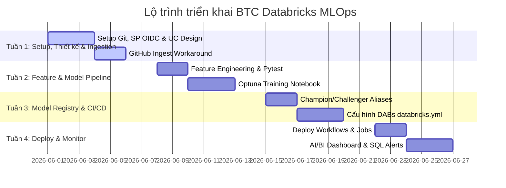

# Báo cáo Nghiên cứu Kỹ thuật (Rút gọn): Đánh giá Kế hoạch Triển khai BTC Databricks MLOps

Báo cáo này đánh giá tính khả thi và đề xuất tối ưu hóa hệ thống MLOps dự báo giá BTC theo giờ trên nền tảng **Databricks Free Edition**.

---

## 1. Phát hiện Kỹ thuật Cốt lõi & Giải pháp

### 1.1. Giới hạn mạng (Outbound Block)
* **Vấn đề:** Môi trường Serverless Compute của Databricks Free Edition chặn kết nối internet ra ngoài, không thể gọi trực tiếp Binance API.
* **Giải pháp:** Sử dụng một runner trung gian độc lập (GitHub Actions Runner hoặc AWS Lambda free tier) để tải dữ liệu Binance -> Đóng gói Parquet/CSV -> Dùng Databricks CLI upload lên một Unity Catalog Volume.

### 1.2. Giới hạn tài nguyên (Compute Quotas)
* **Vấn đề:** Chạy Optuna với 50 trials liên tục dễ làm cạn kiệt hạn ngạch compute miễn phí hàng ngày.
* **Giải pháp:** Giảm số lượng trials xuống còn **15–20**, cấu hình `MedianPruner` để dừng sớm các trial kém và tăng chu kỳ retrain lên 6h hoặc 12h/lần.

### 1.3. Quản lý mô hình (Model Registry)
* **Vấn đề:** MLflow trong Unity Catalog đã deprecated việc quản lý theo Stage (`Staging`/`Production`).
* **Giải pháp:** Sử dụng **Model Aliases** (`@Champion` và `@Challenger`) và gán nhãn động bằng SQL hoặc Python API.

### 1.4. Xác thực CI/CD bảo mật
* **Vấn đề:** Dùng Personal Access Tokens (PAT) dài hạn dễ lộ lọt bảo mật.
* **Giải pháp:** Cấu hình **Workload Identity Federation (OIDC)** giữa GitHub và Databricks Service Principal để lấy token JWT ngắn hạn.

---

## 2. Bảng so sánh Registry: Stage-based vs Alias-based

| Tiêu chí | Stage-based (Cũ) | Alias-based (Hiện tại - Unity Catalog) |
|---|---|---|
| **Cơ chế** | Chuyển Stage cứng (`Staging`, `Production`) | Sử dụng các thẻ tên động (Aliases như `@Champion`, `@Challenger`) |
| **Bảo mật** | Phân quyền mức Workspace rộng | Phân quyền 3 cấp bằng SQL GRANT trong Unity Catalog |
| **Đường dẫn** | `models:/<model_name>/production` | `models:/<catalog>.<schema>.<model_name>@Champion` |
| **Khuyến nghị** | Đã bị loại bỏ (Deprecated) | Khuyến nghị sử dụng chính thức |

---

## 3. Lộ trình Triển khai & Quản lý Rủi ro (4 Tuần)

### Giảm thiểu Rủi ro:
1. **Outbound Block:** Nạp dữ liệu gián tiếp qua GitHub Actions Runner -> UC Volume.
2. **Cạn kiệt Compute Quota:** Giảm trials Optuna, dùng pruner dừng sớm, giãn cách chu kỳ huấn luyện.
3. **Trôi lệch dữ liệu (Drift):** Định kỳ ghi nhận thực tế (`actual_close`) để tính toán sai số (RMSE/MAPE) của `@Champion` trên AI/BI Dashboard.

---

## 4. Hành động Tiếp theo (Next Steps)
1. **Viết script Ingestion trung gian** để chạy trên GitHub Actions.
2. **Đăng ký Service Principal** trên Databricks phục vụ kết nối OIDC.
3. **Cài đặt local environment** với `databricks-connect` để chuẩn bị viết unit test.
