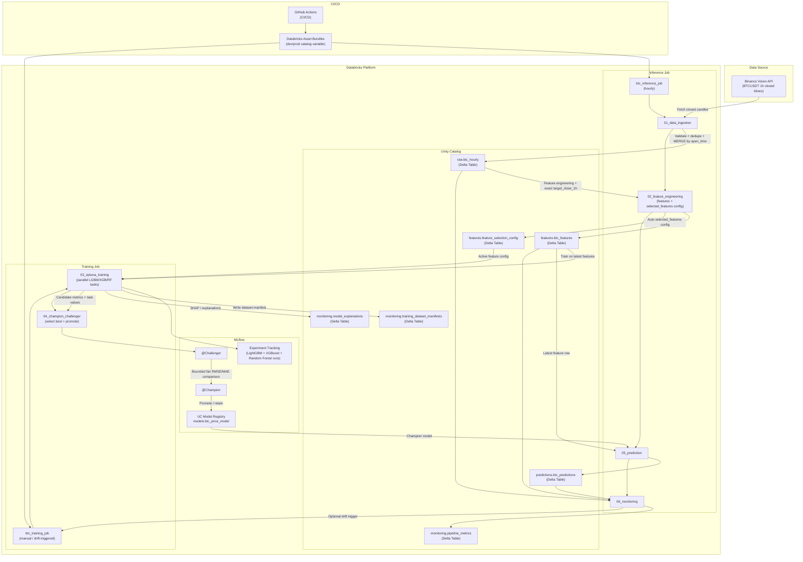

# Architecture

## Tổng Quan Kiến Trúc

BTC Databricks MLOps là pipeline dự đoán giá Bitcoin theo chu kỳ hourly, chạy trên Databricks Asset Bundles và Unity Catalog. Kiến trúc hiện tại tách hourly inference khỏi training để giảm compute: `btc_inference_job` chạy theo giờ, còn `btc_training_job` chạy manual hoặc khi monitoring trigger drift.



Mỗi lần chạy inference job sẽ lấy nến BTC hourly đã đóng từ Binance Vision API, ghi trực tiếp vào raw Delta table, rebuild feature table, tạo prediction bằng Champion hiện tại, sau đó ghi monitoring và drift metrics. Training job huấn luyện LightGBM, XGBoost và Random Forest trên feature table mới nhất, chọn challenger tốt nhất, rồi promotion Champion/Challenger nếu đạt điều kiện.

Các lớp dữ liệu chính:
- `raw.btc_hourly`: dữ liệu OHLCV hourly từ Binance.
- `features.btc_features`: feature table và target next-hour.
- `features.feature_selection_config`: cấu hình feature active dùng cho training.
- `predictions.btc_predictions`: prediction output kèm lineage.
- `monitoring.*`: metrics, manifests, explanations và audit tables.
- `models.btc_price_model`: UC registered model với alias `@Champion` và `@Challenger`.

Thiết kế ưu tiên serving path ngắn và chi phí thấp: không còn UC Volume landing hay Auto Loader staging. Training được tách khỏi hourly inference và chỉ chạy manual hoặc khi drift trigger đủ ngưỡng.

## Data Flow

1. **Direct Binance ingestion** -> `01_data_ingestion` fetches closed BTC hourly candles from Binance Vision API and MERGEs them into `<catalog>.raw.btc_hourly`.
2. **Feature Engineering + Selection** -> `02_feature_engineering` writes `<catalog>.features.btc_features` with exact next-hour target `target_close_1h` and updates active selected-feature metadata in `<catalog>.features.feature_selection_config`.
3. **Prediction** -> `<catalog>.predictions.btc_predictions` using `@Champion`; return forecasts are converted to `predicted_close` for monitoring.
4. **Monitoring** -> `<catalog>.monitoring.pipeline_metrics`, pipeline metrics, drift metrics, and optional training-trigger metrics.
5. **Model Training** -> On-demand regression-only Optuna LightGBM/XGBoost/Random Forest training + MLflow tracking.
6. **Champion vs Challenger** -> Select the best candidate run, register it as Challenger, evaluate Challenger and current Champion on the same bounded holdout rows, then promote only if RMSE and MAE improve and directional accuracy does not regress.

## Multi-Environment

| Environment | Unity Catalog | DABs Target |
|-------------|---------------|-------------|
| Simplying   | `btc_simply`     | `simplying` |
| Production  | `btc_prod`    | `prod`      |

## Schedules

- **Inference job**: every hour; runs ingestion, feature engineering, Champion prediction, and monitoring.
- **Training job**: manual or drift-triggered; runs parallel model training and Champion/Challenger promotion.

## Environment Parameterization

Databricks notebooks read the `catalog` widget passed by Databricks Asset Bundles. The `simplying` target passes `btc_simply`; the `prod` target passes `btc_prod`.

## Data Correctness Rules

- Fetch excludes currently open candles by requiring Binance `close_time` to be before current UTC time.
- Feature target is an exact one-hour lookup, not just the next available row.
- Feature selection config is append-only with one active config; each config records source feature table version, target column, candidates, dropped features, and selection metrics.
- Ingestion reads from the latest raw `open_time` by default and can backfill from a `start_date` widget.
- Ingestion deduplicates overlapping Binance candles by `open_time` before MERGE.
- Training logs Delta versions for raw/features/config tables into MLflow and `monitoring.training_dataset_manifests`.
- Champion/Challenger evaluation uses a bounded latest common holdout window so both models are compared on identical rows without loading the full feature table.
- Predictions store model version/run ID, prediction-input raw/features Delta versions, and Champion training data/config versions for traceability.

## Drift Monitoring Status

Current monitoring is operational fallback monitoring, not full statistical drift detection.

Implemented now:
- Raw freshness.
- Raw duplicate/null timestamp checks.
- Feature row count and target null checks.
- Prediction availability and age.
- Actual-vs-predicted SQL queries for dashboard/alerts.
- Job quality metrics, including success rate, failed runs, failed tasks, and latest run duration.

Implemented drift monitoring:
- `notebooks/06_monitoring.py` writes drift metrics into `<catalog>.monitoring.pipeline_metrics`.
- Data drift: PSI and approximate KS for selected features.
- Label drift: PSI/KS for `target_close_1h`.
- Prediction drift: PSI/KS for `predicted_close`.
- Model/performance drift: rolling RMSE, MAE, MAPE, p95 absolute error, direction accuracy.
- Concept drift proxy: rolling signed error bias.

Retraining flow:

```text
Manual run or drift-triggered run
        ↓
Read latest feature table and active feature config
        ↓
Train LightGBM, XGBoost and Random Forest on latest feature table
        ↓
Select best challenger, promote if evaluation passes
```

Job structure:
- `btc_inference_job` runs hourly: ingestion, feature engineering, Champion prediction, and monitoring.
- `btc_training_job` runs manually or when monitoring triggers it: parallel LightGBM/XGBoost/Random Forest training followed by Champion/Challenger promotion.
- Training is decoupled from hourly inference to avoid retraining on the full feature table every hour.
