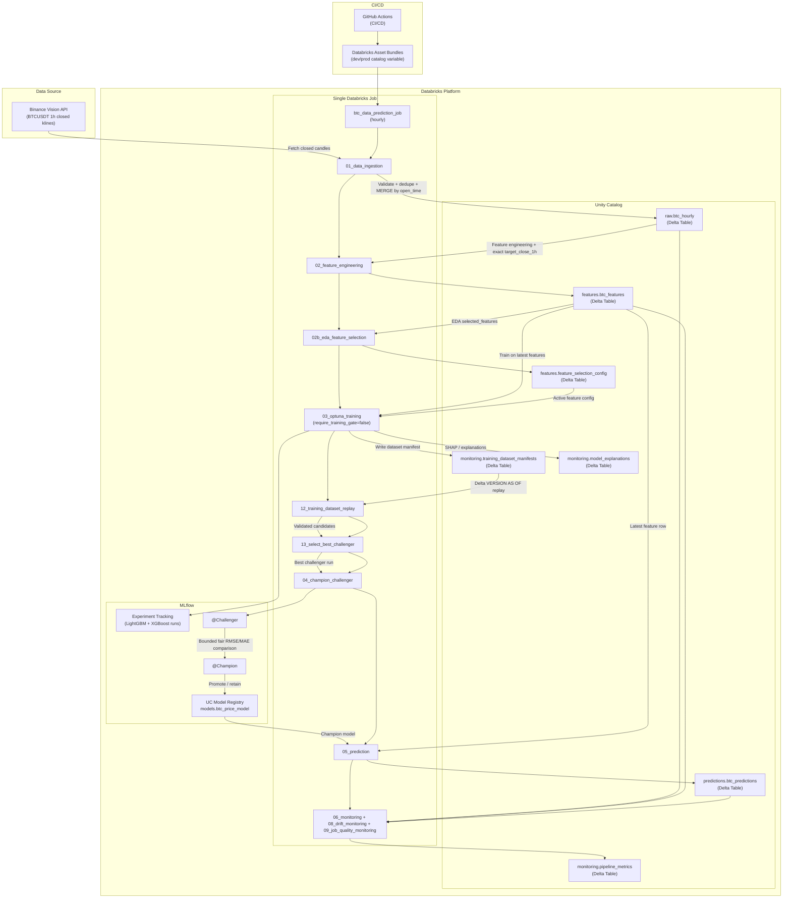

# Architecture

## Tổng Quan Kiến Trúc

BTC Databricks MLOps là pipeline dự đoán giá Bitcoin theo chu kỳ hourly, chạy trên Databricks Asset Bundles và Unity Catalog. Kiến trúc hiện tại được đơn giản hóa thành một job duy nhất: `btc_data_prediction_job`.



Mỗi lần chạy job sẽ lấy nến BTC hourly đã đóng từ Binance Vision API, ghi trực tiếp vào raw Delta table, rebuild feature table, chọn feature active, huấn luyện LightGBM và XGBoost trên dữ liệu mới nhất, kiểm tra khả năng replay dataset, chọn challenger tốt nhất, promotion Champion/Challenger nếu đạt điều kiện, tạo prediction, sau đó ghi monitoring và drift metrics.

Các lớp dữ liệu chính:
- `raw.btc_hourly`: dữ liệu OHLCV hourly từ Binance.
- `features.btc_features`: feature table và target next-hour.
- `features.feature_selection_config`: cấu hình feature active dùng cho training.
- `predictions.btc_predictions`: prediction output kèm lineage.
- `monitoring.*`: metrics, manifests, decisions, explanations và audit tables.
- `models.btc_price_model`: UC registered model với alias `@Champion` và `@Challenger`.

Thiết kế ưu tiên sự đơn giản vận hành: không còn job drift/model-refresh tách riêng, không còn UC Volume landing hay Auto Loader staging. Training chạy trực tiếp trên feature table mới nhất trong cùng hourly job bằng `require_training_gate=false`; monitoring/drift vẫn được ghi sau prediction để theo dõi chất lượng pipeline và model.

## Data Flow

1. **Direct Binance ingestion** -> `01_data_ingestion` fetches closed BTC hourly candles from Binance Vision API and MERGEs them into `<catalog>.raw.btc_hourly`.
2. **Feature Engineering** -> `<catalog>.features.btc_features` with exact next-hour target `target_close_1h`.
3. **Feature Selection Config** -> `02b_eda_feature_selection` writes append-only active selected-feature metadata into `<catalog>.features.feature_selection_config`.
4. **Model Training** -> Regression-only Optuna LightGBM/XGBoost training + MLflow tracking.
5. **Dataset Replay Validation** -> `12_training_dataset_replay` validates Delta `VERSION AS OF` reproducibility from `training_dataset_manifests`.
6. **Champion vs Challenger** -> Register current training run as Challenger, evaluate Challenger and current Champion on the same bounded holdout rows, then promote only if RMSE and MAE improve and directional accuracy does not regress.
7. **Prediction** -> `<catalog>.predictions.btc_predictions` using `@Champion`; return forecasts are converted to `predicted_close` for monitoring.
8. **Monitoring** -> `<catalog>.monitoring.pipeline_metrics`, drift metrics, and job quality metrics.

## Multi-Environment

| Environment | Unity Catalog | DABs Target |
|-------------|---------------|-------------|
| Dev         | `btc_simply`     | `dev`       |
| Production  | `btc_prod`    | `prod`      |

## Schedules

- **Data prediction job**: every hour; runs the full data, training, prediction, and monitoring path.

## Environment Parameterization

Databricks notebooks read the `catalog` widget passed by Databricks Asset Bundles. The default is `btc_simply`; the prod target passes `btc_prod`.

## Data Correctness Rules

- Fetch excludes currently open candles by requiring Binance `close_time` to be before current UTC time.
- Feature target is an exact one-hour lookup, not just the next available row.
- Feature selection config is append-only with one active config; each config records source feature table version, target column, candidates, dropped features, and selection metrics.
- Ingestion reads from the latest raw `open_time` by default and can backfill from a `start_date` widget.
- Ingestion deduplicates overlapping Binance candles by `open_time` before MERGE.
- Training logs Delta versions for raw/features/config tables into MLflow and `monitoring.training_dataset_manifests`.
- `12_training_dataset_replay` validates that manifest versions are still available with Delta time travel and that the replayed training dataset matches the manifest before model promotion.
- Champion/Challenger evaluation uses a bounded latest common holdout window so both models are compared on identical rows without loading the full feature table.
- Predictions store model version/run ID, prediction-input raw/features Delta versions, and Champion training data/config versions for traceability.

## Drift Monitoring Status

Current monitoring is operational fallback monitoring, not full statistical drift detection.

Implemented now:
- Raw freshness.
- Raw duplicate/null timestamp checks.
- Feature row count and target null checks.
- Prediction availability and age.
- Actual-vs-predicted SQL queries for dashboard/alerts.
- Job quality metrics, including success rate, failed runs, failed tasks, and latest run duration.

Implemented drift monitoring:
- `notebooks/08_drift_monitoring.py` writes drift metrics into `<catalog>.monitoring.pipeline_metrics`.
- Data drift: PSI and approximate KS for selected features.
- Label drift: PSI/KS for `target_close_1h`.
- Prediction drift: PSI/KS for `predicted_close`.
- Model/performance drift: rolling RMSE, MAE, MAPE, p95 absolute error, direction accuracy.
- Concept drift proxy: rolling signed error bias.

Retraining flow:

```text
New scheduled hourly run
        ↓
Ingest latest closed Binance candles
        ↓
Rebuild features and selected-feature config
        ↓
Train LightGBM and XGBoost on latest feature table
        ↓
Validate dataset replay, select best challenger, promote if evaluation passes
```

Job structure:
- `btc_data_prediction_job` runs the full hourly path: ingestion, feature engineering, feature selection, LightGBM/XGBoost training, dataset replay, best-challenger selection, Champion/Challenger promotion, prediction, regular monitoring, drift monitoring, and job quality monitoring.
- Training in this job passes `require_training_gate=false`, so it trains directly on the latest feature table instead of waiting for a model-refresh decision.
